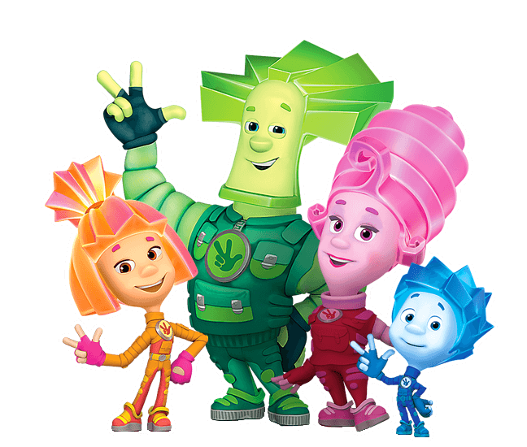

# 🎁 Amigo Secreto - Sorteador de Participantes

Este proyecto es una aplicación web interactiva creada con HTML, CSS y JavaScript que permite registrar una lista de participantes y sortear aleatoriamente al "Amigo Secreto" entre ellos.

## 📸 Captura



---

## 🚀 Funcionalidades

- Agregar nombres sin repetir, con validación de texto.
- Ver listado numerado de participantes.
- Contador dinámico de participantes.
- Sorteo aleatorio de un amigo secreto.
- Mensajes de validación visuales.
- Botón para reiniciar el juego y comenzar desde cero.
- Estilo moderno, accesible y adaptable.

---

## 🛠️ Tecnologías utilizadas

- **HTML5**
- **CSS3**
- **JavaScript Vanilla**

---

## ⚙️ Cómo ejecutar el proyecto

1. Clona este repositorio:

```bash
git clone https://github.com/jriojac/amigo-secreto.git


## 👩‍💻 Autora

**Jacqueline Rioja**  
📫 Contacto: jriojac@gmail.com  
🔗 GitHub: https://github.com/jriojac

---

## 📄 Licencia

Este proyecto está licenciado bajo la **Licencia MIT**.  
Consulta el archivo [LICENSE](LICENSE) para más información.
